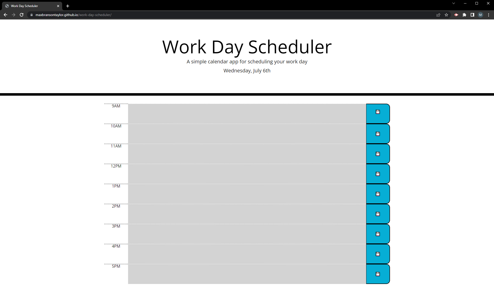

# Work Day Scheduler

## Description

This application allows the user to create an hourly schedule for their work day. Items for each hour can be edited on click and saved to local storage by pressing the corresponding save button. The application also uses moment.js to display the current date at the top of the page, and to color code each hourly item based on if it is past, present, or future.

[Link to deployed application](https://maxbransontaylor.github.io/work-day-scheduler/)
